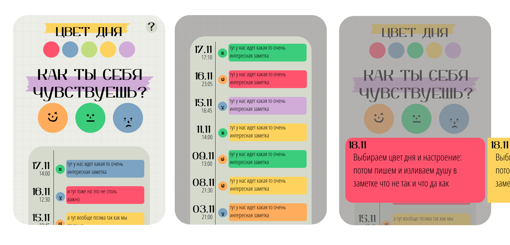
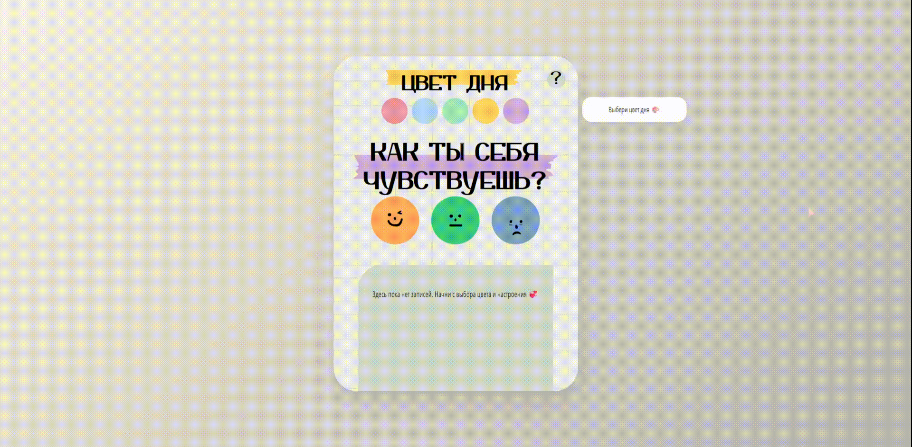

# Mood Journal

[Live Demo](https://mood-journal-one-mauve.vercel.app/) 🌐


## О проекте
**Mood Journal** — минималистичное веб-приложение для ведения дневника настроения.  
Позволяет отслеживать эмоции, делать заметки и сохранять их прямо в браузере.

Проект создан **для портфолио** и демонстрирует работу с состояниями, пользовательским вводом и архитектурой React-приложения.

🖌 **Дизайн и UX разработаны мной самостоятельно** — от идеи до финальной реализации.




## Стек технологий
- **React** — функциональные компоненты и хуки  
- **TypeScript** — типизация и интерфейсы  
- **Vite** — быстрая сборка и dev-сервер  
- **CSS Modules** — модульные и изолированные стили  


## Основной функционал
- Выбор текущего настроения  
- Ввод текстовой заметки  
- Сохранение данных в `localStorage`  
- Сохранение состояния при перезагрузке страницы  
- Минималистичный, чистый интерфейс  




## Цель проекта
- Практика работы с React и TypeScript  
- Работа с состояниями и пользовательским вводом  
- Создание простого и интуитивного UI  
- Проектирование структуры небольшого SPA  


## Структура проекта
```txt
src
├─ assets       # изображения, SVG и декорации
├─ components   # UI-компоненты
├─ constants    # основные цвета
├─ pages        # страницы сайта
├─ types        # TypeScript типы
├─ utils        # вспомогательные функции
└─ main.tsx     # точка входа
```

## Запуск
```
npm install
npm run dev
```

## Репозиторий
[GitHub Mood Journal](https://github.com/AlekSidorova/mood-journal)


## Контакты
Если есть вопросы, свяжитесь со мной: **Александра Сидорова**  
Email: mehaleka240399@yandex.com